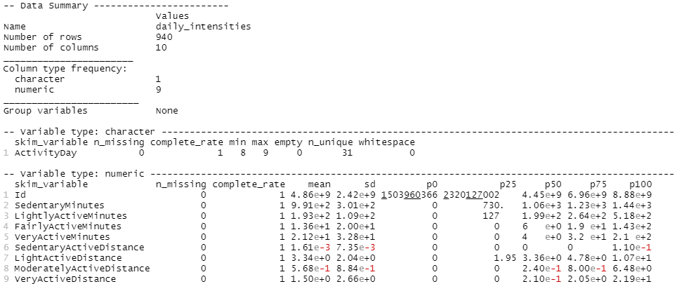
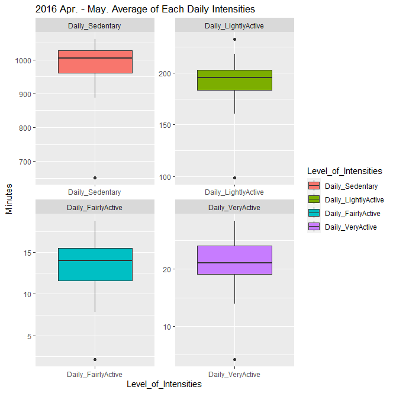
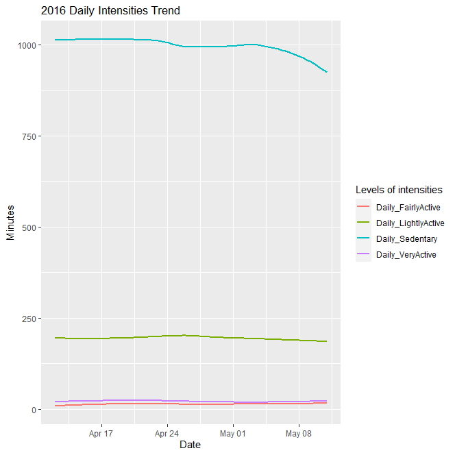

# Bellabeat Product Analytics

Bellabeat is a company that specializes in creating health-focused smart devices for women worldwide. Their products allow users to monitor their health data, such as stress levels and heart rate. This project focuses on analyzing the smart devices for Bellabeat and providing insights for their marketing strategy team.

## The Purpose of This Project :basketball:
The main goal of this project is to understand the daily behavior of the majority of Bellabeat's customers, such as their daily activity intensities or calorie burns. By understanding customer behavior, Bellabeat can develop an appropriate marketing strategy in the future.

The business questions that I will answer include:
1. What are some trends in smart device usage?
2. How could these trends apply to Bellabeat customers?
3. How could these trends help influence Bellabeat marketing strategy?

## Data Sources :video_game:
The dataset, [FitBit Fitness Tracker Data](https://www.kaggle.com/datasets/arashnic/fitbit), is from Kaggle and was generated by respondents to a distributed survey. Each respondent is an eligible Fitbit user who consented to the submission of their personal health data.

## Data Manipulation :kite:
### Checking Data Integrity
By reviewing the summary table of the daily intensities dataset, we can see that the "ActivityDay" column is of character type, which may impact my analysis later. To resolve this, I will convert it into a date type. Additionally, I thoroughly reviewed the dataset to ensure that there are no missing values that could affect my analysis.

## Analysis :spades:
I chose to use R as the analysis tool for this project due to its wide range of plotting packages and powerful data analysis capabilities. R makes it easy to create professional-looking visualizations and perform complex data analysis tasks.

### Checking the Average Minutes of Daily Intensities
The daily intensities dataset includes four types of activity: sedentary, light active, fairly active, and very active.

The boxplot can be used to identify the distribution of each activity level. From the chart, it appears that the sedentary activity level has the highest average minutes, indicating that most customers spend a significant amount of time sitting and not engaging in intense physical activity throughout the day. The average minutes for sedentary activity is 991, for light activity is 193, for fairly active is 13.6, and for very active is 21.2. There are large gaps between each category. The marketing strategy team should consider this information in customer behavior as an important factor in their strategy.

### The Activity Trend

The gaps between each activity level are more obvious in a line plot. The sedentary activity level is significantly above other activities. Although the trend has declined slightly over time, it is still significantly higher than other activities.
The decline in sedentary activity may indicate that customers are intentionally reducing their sedentary activity due to using our product. However, to prove this hypothesis, additional data would be needed.
Additionally, by analyzing this plot, we can see that we need to find ways to help customers reduce the proportion of sedentary activity and increase the proportion of light activity throughout the day. According to research, sedentary activity should not exceed 800 minutes, as it can have negative effects on health. Other activity levels appear to be stable, and there is still room for improvement among customers.

## Recommendations :medal_sports:
### Creating dashboard or monthly report for each customer
Creating a dashboard and monthly report can provide a way for customers to monitor their progress. Using the dashboard to track metrics such as average minutes spent on different activities can inspire customers and provide positive feedback on the effectiveness of our product. These tools can help customers to set goals and see improvement over time, which can be a great motivation for them to maintain healthy habits. Additionally, the marketing team can use the insights from these tools to tailor their strategies to better meet the needs and preferences of the customers.

### Making Products or Strategy to Encourage Customer Reduce Sedentary
1. Collaborating with fitness experts to create educational content that helps customers understand the benefits of reducing sedentary activity and how to achieve this in a practical way.
2. Creating a personalized training program for customers based on their activity levels and goals.
3. Creating a social platform where customers can connect with other customers, share their progress, and receive encouragement and support.
4. Offering incentives or rewards for customers who meet daily activity goals, such as discounts on future purchases or access to exclusive content.
5. Developing a mobile app that sends reminders and prompts to customers to stand up and move around at regular intervals throughout the day.

